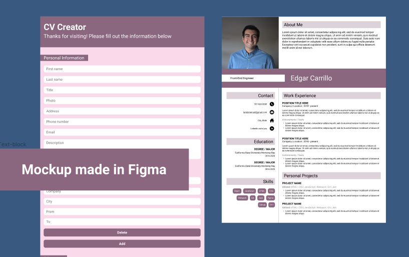

<h1 align="center">CV-Creator</h1>

<p align="center" width="100%">
    
</p>

<h4 align="center">CV Creation made easy.</h4>
<p align="center"> <a href="#">[Redacted]</a></p>

## Motivation and Story
I'm looking to improve my skillset with React in this project. This project should take a deep dive into using 
props and state by using it in multiple components that make up both the data-collection and resume portion of 
the project. I'll also be flexing my testing muscle by implementing tests using the react-testing-library.

Please note, this project is created using <a href="https://create-react-app.dev/">create-react-app</a>.

## Code Styles
This project follows the [Airbnb JavaScript Style Guide](https://github.com/airbnb/javascript).

Eslint and Prettier were also used in this project.

## Tech Stack
**Built with**
- [React](https://reactjs.org/)
- [Prettier](https://prettier.io/)
- [ESlint](https://eslint.org/)
- [Babel](https://babeljs.io/)
- [Webpack](https://webpack.js.org/)
- [Jest](https://jestjs.io/docs/getting-started)
- [npm](https://www.npmjs.com/)

## Repository Installation
```
$ git clone git@github.com:ec-rilo/cv-application.git
$ cd cv-application.git

$ npm install
```

## Tests
All tests are run using Jest and react-testing-library.

To install Jest please follow the [Getting Started Page](https://jestjs.io/docs/getting-started) on the
Jest website.

To install react-testing-library type `npm install --save-dev @testing-library/dom` in the terminal.
To learn more please read the docs at <a href="npm install --save-dev @testing-library/react">testing-library.com/react</a>

## Credits

## Contact
**Edgar Carrillo**
</br>
- [Linkedin](https://www.linkedin.com/in/ecarrillo046/)
- [Github](https://github.com/ec-rilo)


<p align="center">Project created by <a href="https://github.com/ec-rilo">Edgar Carrillo</a></p>
